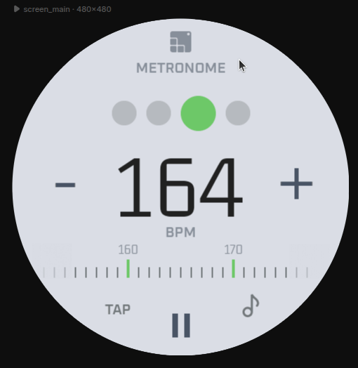
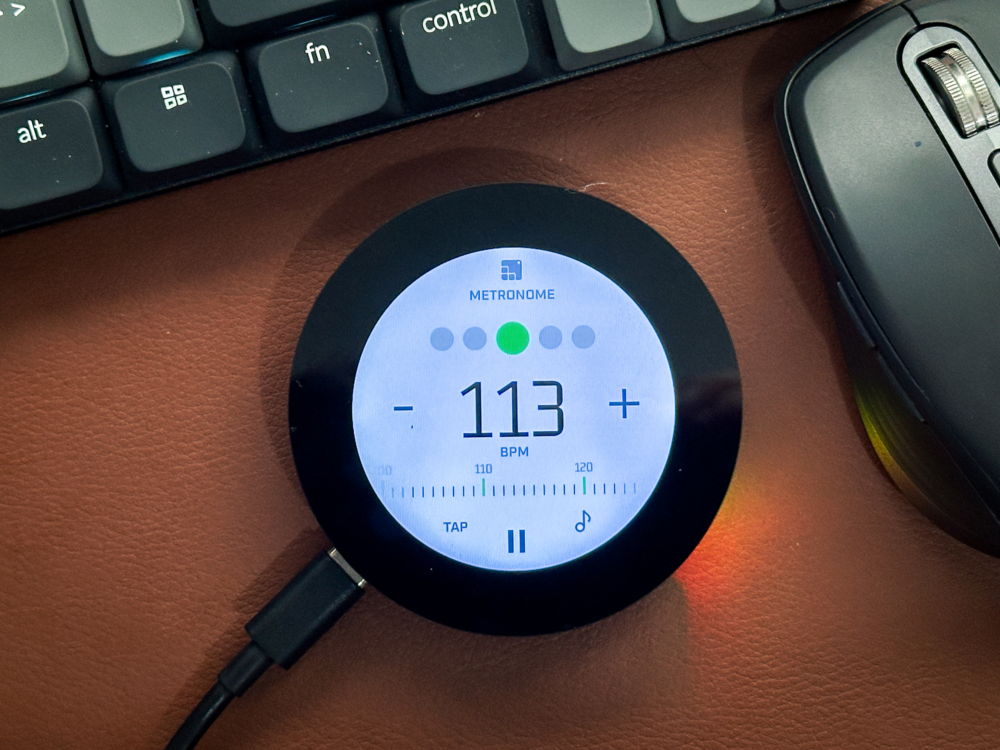
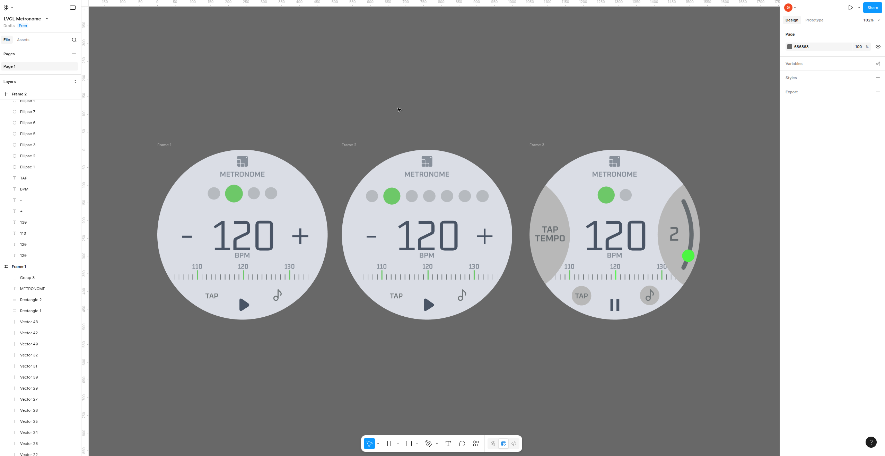

# Metronome UI made with LVGL Pro (UI Editor)

This is a musical metronome where you can set BPM, tap tempo and set beats per measure.

  

Test it online here with LVGL Pro Online Viewer: https://viewer.lvgl.io/?repo=https://github.com/giobauermeister/metronome_ui_lvgl_pro/tree/main/metronome_ui

Metronome running on Waveshare round display: [https://www.waveshare.com/esp32-s3-touch-lcd-2.1.htm](https://www.waveshare.com/esp32-s3-touch-lcd-2.1.htm)

  

Figma link with design: [https://www.figma.com/design/y1oMZdM1V39vFfN3xiN8Jt/LVGL-Metronome](https://www.figma.com/design/y1oMZdM1V39vFfN3xiN8Jt/LVGL-Metronome)

